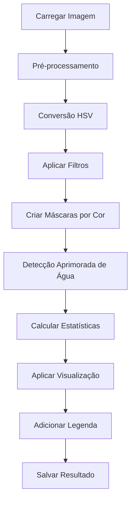

# Sistema de Análise de Risco de Desmoronamento e Detecção de Enchentes

## 📋 Índice
- [Visão Geral](#visão-geral)
- [Objetivos](#objetivos)
- [Tecnologias Utilizadas](#tecnologias-utilizadas)
- [Instalação e Configuração](#instalação-e-configuração)
- [Como Funciona](#como-funciona)
- [Estrutura do Código](#estrutura-do-código)
- [Metodologia de Detecção](#metodologia-de-detecção)
- [Interface do Usuário](#interface-do-usuário)
- [Resultados e Interpretação](#resultados-e-interpretação)
- [Limitações](#limitações)
- [Casos de Uso](#casos-de-uso)
- [Conclusões](#conclusões)

---

## 🌍 Visão Geral

O **Sistema de Análise de Risco de Desmoronamento e Detecção de Enchentes** é uma aplicação desenvolvida em Python que utiliza técnicas de processamento de imagens e visão computacional para identificar e classificar diferentes tipos de terreno em imagens de satélite ou aéreas, avaliando automaticamente os riscos de desmoronamento e enchentes.

### Funcionalidades Principais
- ✅ **Detecção automática** de 5 tipos de terreno
- ✅ **Análise de risco** baseada em características do solo
- ✅ **Processamento em lote** de múltiplas imagens
- ✅ **Geração de relatórios visuais** com legendas e estatísticas
- ✅ **Interface interativa** para facilitar o uso

---

## 🎯 Objetivos

### Objetivo Geral
Desenvolver uma ferramenta automatizada para análise de riscos ambientais em imagens de sensoriamento remoto, auxiliando na prevenção de desastres naturais e no planejamento territorial.

### Objetivos Específicos
1. **Classificar automaticamente** diferentes tipos de cobertura do solo
2. **Identificar áreas de risco** para desmoronamentos e enchentes
3. **Quantificar percentualmente** cada tipo de terreno na imagem
4. **Gerar alertas visuais** para áreas críticas
5. **Facilitar a interpretação** através de interface amigável

---

## 🛠 Tecnologias Utilizadas

### Linguagem de Programação
- **Python 3.7+** - Linguagem principal do projeto

### Bibliotecas Principais
- **OpenCV (cv2)** - Processamento de imagens e visão computacional
- **NumPy** - Operações matemáticas e manipulação de arrays
- **OS/Sys** - Operações do sistema operacional
- **Datetime** - Manipulação de datas e timestamps

### Técnicas Implementadas
- **Segmentação por cor no espaço HSV**
- **Operações morfológicas**
- **Filtragem bilateral**
- **Limiarização adaptativa**
- **Análise estatística de pixels**

---

## 💻 Instalação e Configuração

### Pré-requisitos
```bash
# Python 3.7 ou superior
python --version

# Pip (gerenciador de pacotes)
pip --version
```

### Instalação das Dependências
```bash
# Instalar OpenCV
pip install opencv-python

# Instalar NumPy
pip install numpy

# Alternativa: instalar todas de uma vez
pip install opencv-python numpy
```

### Executando o Programa
```bash
# No terminal/prompt de comando
python flood_landslide_processor.py
```

---

## ⚙️ Como Funciona

### Fluxo Principal do Sistema



### Processo Detalhado

1. **Carregamento da Imagem**
   - Verificação da existência do arquivo
   - Validação do formato da imagem
   - Redimensionamento automático para otimização

2. **Pré-processamento**
   - Aplicação de filtro bilateral para redução de ruído
   - Conversão do espaço de cores BGR para HSV
   - Preparação dos dados para análise

3. **Segmentação por Cores**
   - Definição de intervalos HSV para cada tipo de terreno
   - Criação de máscaras binárias para cada categoria
   - Aplicação de operações morfológicas para limpeza

4. **Detecção Especializada**
   - Algoritmo específico para detecção de água/enchentes
   - Combinação de múltiplos critérios (luminosidade, saturação)
   - Filtragem de falsos positivos

5. **Análise Estatística**
   - Contagem de pixels por categoria
   - Cálculo de percentuais de cobertura
   - Geração de métricas de risco

6. **Visualização e Saída**
   - Sobreposição de cores identificativas
   - Adição de legenda e estatísticas
   - Geração de alertas automáticos
   - Salvamento com timestamp

---

## 🏗 Estrutura do Código

### Classe Principal: `FloodAndLandslideProcessor`

```python
class FloodAndLandslideProcessor:
    def __init__(self):
        # Configurações de cores e intervalos HSV
        # Parâmetros de transparência e visualização
    
    def load_image(self, image_path):
        # Carregamento e validação de imagens
    
    def enhance_water_detection(self, hsv_image):
        # Algoritmo especializado para detecção de água
    
    def create_masks(self, hsv_image):
        # Criação de máscaras para cada tipo de terreno
    
    def calculate_risk_areas(self, masks, image_size):
        # Cálculo de estatísticas e percentuais
    
    def apply_masks(self, image, masks):
        # Aplicação visual das classificações
    
    def process_image(self, image_path):
        # Método principal de processamento
```

### Tipos de Terreno Detectados

| Tipo | Cor de Identificação | Nível de Risco | Características HSV |
|------|---------------------|----------------|-------------------|
| **Matas** | 🟢 Verde | Baixo | H: 35-85, S: 40-255, V: 40-255 |
| **Área Urbana** | 🔴 Vermelho | Médio | H: 0-180, S: 0-50, V: 100-255 |
| **Pastagem** | 🟡 Amarelo | Alto | H: 25-35, S: 30-255, V: 30-200 |
| **Solo Exposto** | 🔵 Azul | Alto | H: 10-25, S: 50-255, V: 50-200 |
| **Área Alagada** | 🟣 Roxo | Crítico | H: 100-130, S: 50-255, V: 20-150 |

---

## 🔬 Metodologia de Detecção

### Espaço de Cores HSV
O sistema utiliza o espaço de cores **HSV (Hue, Saturation, Value)** por ser mais efetivo na segmentação baseada em cor:

- **Hue (Matiz)**: Identifica o tipo de cor predominante
- **Saturation (Saturação)**: Mede a pureza da cor
- **Value (Valor)**: Representa a intensidade luminosa

### Algoritmo de Detecção de Água
```python
def enhance_water_detection(self, hsv_image):
    # 1. Detecção por baixa luminosidade
    dark_mask = threshold(value_channel < 80)
    
    # 2. Detecção por baixa saturação
    low_sat_mask = threshold(saturation_channel < 50)
    
    # 3. Combinação das condições
    water_mask = bitwise_or(dark_mask, low_sat_mask)
    
    # 4. Limpeza morfológica
    water_mask = morphological_operations(water_mask)
```

### Critérios de Risco

**Baixo Risco (Matas)**
- Vegetação densa oferece estabilidade ao solo
- Boa drenagem natural
- Menor probabilidade de erosão

**Médio Risco (Área Urbana)**
- Impermeabilização do solo
- Alteração do escoamento natural
- Concentração de águas pluviais

**Alto Risco (Pastagem/Solo Exposto)**
- Falta de cobertura vegetal protetora
- Maior susceptibilidade à erosão
- Compactação do solo em pastagens

**Risco Crítico (Áreas Alagadas)**
- Presença de água indica problemas de drenagem
- Saturação do solo
- Alto potencial para deslizamentos

---

## 👤 Interface do Usuário

### Menu Principal
```
============================================================
ANÁLISE DE RISCO DE DESMORONAMENTO E DETECÇÃO DE ENCHENTES
============================================================

1. Processar uma imagem
2. Processar todas as imagens em um diretório
3. Sair

Escolha uma opção (1-3):
```

### Fluxo de Uso

1. **Seleção do Modo**
   - Imagem única: processamento individual
   - Processamento em lote: múltiplas imagens

2. **Entrada de Dados**
   - Caminho da imagem ou diretório
   - Validação automática dos arquivos

3. **Processamento**
   - Feedback em tempo real do progresso
   - Indicadores visuais de cada etapa

4. **Resultados**
   - Estatísticas detalhadas no console
   - Imagem processada salva automaticamente

---

## 📊 Resultados e Interpretação

### Saída Visual
A imagem processada contém:
- **Sobreposição colorida** identificando cada tipo de terreno
- **Legenda explicativa** com cores e descrições
- **Estatísticas percentuais** de cada categoria
- **Alertas automáticos** para situações de risco

### Exemplo de Estatísticas
```
Estatísticas da imagem:
- Matas (Baixo risco): 45.32%
- Área Urbana (Médio risco): 23.15%
- Pastagem (Alto risco): 18.76%
- Solo Exposto (Alto risco): 8.45%
- Área Alagada (Enchente): 4.32%

ALERTA: Areas de enchente detectadas!
```

### Interpretação dos Alertas

**Alerta de Enchente** (> 3% da área)
- Indica presença significativa de água
- Necessidade de verificação de drenagem
- Monitoramento de áreas baixas

**Alerta de Solo Exposto** (> 8% da área)
- Risco elevado de erosão
- Necessidade de cobertura vegetal
- Possível instabilidade do terreno

---

## ⚠️ Limitações

### Técnicas
1. **Dependência da Qualidade da Imagem**
   - Resolução mínima necessária para detecção precisa
   - Condições de iluminação afetam a classificação

2. **Limitações do Algoritmo**
   - Baseado apenas em características visuais
   - Não considera dados topográficos ou geológicos

3. **Intervalos de Cor Fixos**
   - Podem necessitar ajuste para diferentes regiões
   - Variações sazonais podem afetar a detecção

### Operacionais
1. **Tipos de Imagem Suportados**
   - Limitado a formatos raster (JPG, PNG, BMP, TIFF)
   - Não processa dados vetoriais

2. **Processamento Local**
   - Requerer recursos computacionais adequados
   - Sem integração com sistemas GIS externos

---

## 🌟 Casos de Uso

### Planejamento Urbano
- **Análise de expansão urbana** em áreas de risco
- **Identificação de zonas críticas** para construção
- **Planejamento de sistemas de drenagem**

### Gestão Ambiental
- **Monitoramento de desmatamento**
- **Avaliação de impactos ambientais**
- **Identificação de áreas para reflorestamento**

### Prevenção de Desastres
- **Mapeamento de áreas susceptíveis** a deslizamentos
- **Monitoramento de enchentes** em tempo de chuva
- **Planejamento de rotas de evacuação**

### Agricultura e Pecuária
- **Avaliação de pastagens**
- **Identificação de áreas com erosão**
- **Planejamento de práticas conservacionistas**

### Exemplo Prático: Análise de Bacia Hidrográfica
```
Cenário: Análise de risco em área urbana próxima a rio

Entrada: Imagem de satélite da região (5km²)

Resultados:
- Matas: 12% (Preservação de nascentes)
- Urbano: 45% (Área consolidada)
- Pastagem: 25% (Área rural periurbana)
- Solo Exposto: 15% (CRÍTICO - erosão)
- Enchente: 3% (Várzea do rio)

Recomendações:
✓ Revegetação urgente das áreas de solo exposto
✓ Monitoramento da várzea em período chuvoso
✓ Implementação de práticas conservacionistas
```

---

## 📈 Possíveis Melhorias Futuras

### Técnicas Avançadas
1. **Machine Learning**
   - Implementação de redes neurais convolucionais
   - Treinamento com datasets específicos
   - Classificação mais precisa

2. **Integração de Dados**
   - Incorporação de modelos digitais de elevação
   - Dados meteorológicos em tempo real
   - Informações geológicas da região

3. **Processamento Avançado**
   - Análise multispectral (além do RGB)
   - Processamento de séries temporais
   - Detecção de mudanças ao longo do tempo

### Funcionalidades
1. **Interface Gráfica**
   - GUI para facilitar o uso
   - Visualização interativa dos resultados
   - Ferramentas de edição manual

2. **Relatórios Automáticos**
   - Geração de PDFs com análises
   - Gráficos estatísticos detalhados
   - Comparações temporais

3. **Integração com SIG**
   - Exportação para formatos GIS
   - Integração com QGIS/ArcGIS
   - Análises espaciais avançadas

---

## 📝 Conclusões

O **Sistema de Análise de Risco de Desmoronamento e Detecção de Enchentes** representa uma solução inovadora e acessível para análise automatizada de riscos ambientais em imagens de sensoriamento remoto. 

### Principais Contribuições

**Tecnológica**
- Implementação eficiente de algoritmos de visão computacional
- Metodologia robusta para detecção de diferentes tipos de terreno
- Interface simples e intuitiva para usuários não-técnicos

**Prática**
- Ferramenta útil para planejamento territorial
- Apoio à tomada de decisões em gestão ambiental
- Contribuição para prevenção de desastres naturais

**Acadêmica**
- Aplicação prática de conceitos de processamento de imagens
- Demonstração de uso de bibliotecas Python científicas
- Base para desenvolvimentos futuros mais avançados

### Impacto Esperado

O sistema desenvolvido pode contribuir significativamente para:
- **Redução de riscos** através de identificação precoce
- **Otimização de recursos** em monitoramento ambiental
- **Democratização** de tecnologias de análise espacial
- **Conscientização** sobre riscos ambientais

### Considerações Finais

Embora apresente limitações técnicas inerentes à abordagem baseada em processamento de imagens RGB, o sistema oferece uma base sólida para análises preliminares de risco. A metodologia implementada é extensível e pode ser aprimorada com técnicas mais avançadas conforme a evolução das necessidades e disponibilidade de recursos.

A ferramenta desenvolvida demonstra o potencial das tecnologias de código aberto para resolver problemas reais de engenharia e gestão ambiental, contribuindo para a construção de comunidades mais resilientes e preparadas para enfrentar desafios ambientais.

---

## 📚 Referências e Documentação

### Bibliotecas Utilizadas
- OpenCV Documentation: https://docs.opencv.org/
- NumPy User Guide: https://numpy.org/doc/stable/
- Python Official Documentation: https://docs.python.org/3/

### Conceitos Aplicados
- Processamento Digital de Imagens
- Visão Computacional
- Sensoriamento Remoto
- Análise de Riscos Ambientais
- Geoprocessamento

---

**Desenvolvido em 2025 | Sistema de Análise de Risco Ambiental**
